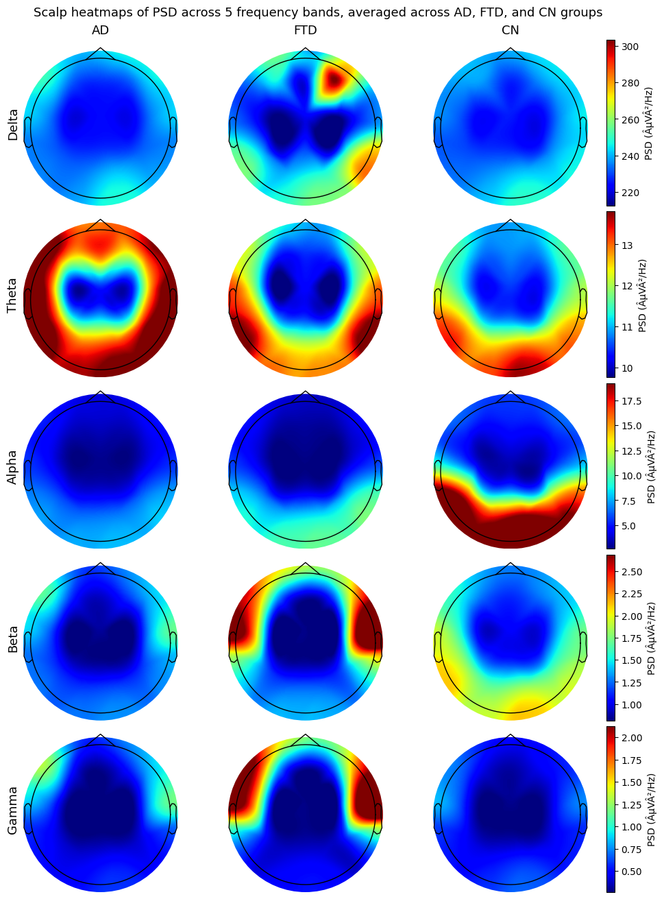
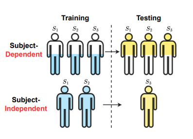

# Subject Identity as a Shortcut in EEG Dementia Classification

*A short experimental note on why subject-independent EEG classification is hard, and why standard shortcut-mitigation methods did not fix it.*

## Contents

- [Motivation](#motivation)
- [The Task](#the-task)
- [Feature-Based Baselines](#feature-based-baselines)
- [Subject-Dependent vs Subject-Independent Evaluation](#subject-dependent-vs-subject-independent-evaluation)
- [A Shortcut-Learning View](#a-shortcut-learning-view)
- [Experiments](#experiments)
- [What Failed, and Why](#what-failed-and-why)
- [Takeaways](#takeaways)
- [Notebooks](#notebooks)
- [References](#references)

## Motivation

EEG-based dementia classification is attractive because EEG is comparatively cheap, non-invasive, and already used in clinical neurology. A model that could separate Alzheimer’s disease (AD), frontotemporal dementia (FTD), and cognitively normal controls (CN) from resting-state EEG would be useful as a screening or decision-support tool.

But there is a catch: EEG is deeply personal.

Two recordings can differ because of disease, but also because of skull conductivityand  electrode artifacts. If the train and test split allows the same subject to appear in both, the model may learn the person instead of the disease.


## The Task

The dataset used here is the ADFTD EEG dataset: resting-state, eyes-closed EEG recordings from subjects diagnosed as AD, FTD, or CN [[1]](https://doi.org/10.18112/openneuro.ds004504.v1.0.8). The OpenNeuro release contains 88 subjects: 36 AD, 23 FTD, and 29 CN.

The supervised task is:

```text
input:  EEG segment
output: AD / FTD / CN
```

This looks like a normal multi-class classification problem. The problem is that the label is attached at the subject level. A subject does not change diagnosis across segments:

```text
sub-001 -> AD
sub-002 -> AD
sub-040 -> CN
sub-071 -> FTD
```

So every segment from a subject inherits the same diagnosis. That simple fact drives most of the difficulty below.

## Feature-Based Baselines

The first notebook implements classical feature extraction before moving to a vanilla Transformer.

For the KNN baseline, EEG windows are converted into relative bandpower-style features. This is a common EEG representation: instead of giving the classifier the raw time series, each window is summarized by the amount of spectral power in frequency bands such as delta, theta, alpha, beta, and gamma.



At a high level:

```text
raw EEG window
    -> frequency decomposition
    -> bandpower per channel / band
    -> feature vector
    -> KNN classifier
```

This baseline is intentionally simple. It asks whether the conventional spectral summaries already separate AD, FTD, and CN.

The neural baseline is a plain Transformer over raw EEG windows:

```text
raw EEG segment
    -> linear projection
    -> positional encoding
    -> Transformer encoder
    -> mean pooling
    -> classifier
```

## Subject-Dependent vs Subject-Independent Evaluation

There are two very different ways to split EEG windows.



In a **subject-dependent** split, windows are shuffled at the sample level. Segments from the same person may appear in train, validation, and test.

In a **subject-independent** split, subjects are split first. If a subject appears in the test set, none of that subject’s windows appear in training.

These two settings answer different questions:

```text
Subject-dependent:
Can the model classify new windows from subjects it may have already seen?

Subject-independent:
Can the model classify windows from entirely unseen subjects?
```

For medical deployment, subject-independent evaluation is the meaningful one. A future patient is not supposed to already be in the training set.

The first notebook reproduces the core phenomenon: models regress sharply when moved from subject-dependent to subject-independent evaluation. This subject-independent setting is also used in the Medformer paper [[3]](https://arxiv.org/abs/2405.19363), where the performance gap between evaluation settings motivates treating unseen-subject generalization as the harder and more clinically meaningful test.

## A Shortcut-Learning View

The shortcut-learning framing follows the argument in **What Causes Performance Degradation in Cross-Subject EEG Classification?** [[4]](https://arxiv.org/pdf/2410.03057v2) , which studies medical time-series datasets where each subject has a single fixed class. The paper calls this a Type-III medical time-series setting and shows that subject-specific features can act as shortcuts for disease labels.

Let an EEG sample contain three kinds of information:

```text
x = (x_d, x_s, x_o)
```

where:

- `x_d` is disease-related signal,
- `x_s` is subject-specific signal,
- `x_o` is other nuisance signal such as noise or artifacts.

In a subject-dependent split, both `x_d` and `x_s` can predict the label. If the same subject appears in train and test, the model can use:

```text
x_s -> subject identity -> diagnosis
```

In a subject-independent split, this shortcut breaks. The test subjects are new, so memorizing subject identity no longer helps.

**What Causes Performance Degradation in Cross-Subject EEG Classification?** [[4]](https://arxiv.org/pdf/2410.03057v2) makes this concrete with two diagnostic setups:

1. **Subject discrimination:** train models to classify subject ID from the signal. High performance means subject identity is easy to recover.
2. **Random-label subject-dependent evaluation:** randomly assign each subject a fake label, then use a subject-dependent split. Disease information is destroyed, but subject identity is preserved.

On ADFTD, the paper reports that Medformer obtains almost the same F1 under real subject-dependent labels and random-label subject-dependent labels: about 97.56% vs 97.12%. In other words, even after disease-label structure is removed, the model still performs almost perfectly because it can recognize subjects and map subjects to labels.

That result motivates this project’s hypothesis:

> If subject-independent collapse is caused by subject identity acting as a shortcut, can shortcut-mitigation methods reduce the collapse?

## Experiments

The project is organized into two notebooks.

### 1. Baselines

[](https://colab.research.google.com/github/ssoufiene/shortcut_eeg/blob/main/baselines.ipynb)

[`baselines.ipynb`](baselines.ipynb) implements:

- KNN on extracted EEG bandpower features,
- a vanilla Transformer on raw EEG windows,
- subject-dependent evaluation,
- subject-independent evaluation,
- checkpoint saving for the Transformer models.

The goal is to establish the empirical gap: performance is much better when the model can see windows from the same subjects during training and testing.

### 2. Shortcut Mitigation

[](https://colab.research.google.com/github/ssoufiene/shortcut_eeg/blob/main/shortcut.ipynb)

[`shortcut.ipynb`](shortcut.ipynb)  tests three methods from the shortcut-learning literature:

- JTT: Just Train Twice [[6]](https://proceedings.mlr.press/v139/liu21f.html).
- GroupDRO: group distributionally robust optimization [[5]](https://arxiv.org/abs/1911.08731).
- DFR: last-layer retraining / deep feature reweighting [[7]](https://openreview.net/forum?id=Zb6c8A-Fghk).


## What Failed, and Why


### JTT

JTT [[6]](https://proceedings.mlr.press/v139/liu21f.html) first trains an ERM model, identifies training examples that ERM misclassified, and then trains a second model with those examples upweighted.

This works best when early ERM mistakes are enriched for shortcut-conflicting examples. For example, in Waterbirds, a landbird on water is rare and likely to be misclassified by a model that learned background. Upweighting those mistakes tells the model to pay attention to the bird instead of the background.

In our EEG setting, a misclassified window is not necessarily shortcut-conflicting. It may be noisy, artifact-heavy, ambiguous, or from a hard subject. Upweighting it does not necessarily reveal disease-specific structure.

### GroupDRO

GroupDRO [[5]](https://arxiv.org/abs/1911.08731) minimizes worst-group loss. We tried oracle groups of the form:

```text
group = diagnosis x subject
```

At first, this sounds right: if subject identity is the shortcut, then maybe subject-level groups should help.

But `diagnosis x subject` does not create shortcut-conflicting groups. It mostly creates one group per subject-label pair. Since every subject has exactly one diagnosis, the group is still entangled with the label.

GroupDRO can therefore try to improve hard subjects, but it never sees evidence like:

```text
same subject style, different diagnosis
```

or:

```text
same diagnosis, shortcut broken
```

The groups are too specific to act like reusable shortcut groups.

### DFR

DFR [[7]](https://openreview.net/forum?id=Zb6c8A-Fghk) freezes the encoder of an ERM model and retrains only the final classifier on a balanced validation set. The motivating claim from Kirichenko et al. is that neural networks may still learn core features even when the classifier relies heavily on spurious features; retraining the last layer can recover a better decision boundary.

This was the most deceptive experiment.

DFR improved validation performance, but the improvement did not transfer to the subject-independent test set. The likely explanation is that the last layer learned a correction for the validation subjects, not a disease-invariant boundary for unseen subjects.

This is especially plausible if the same validation subjects are used both for DFR retraining and for early stopping. Then validation performance is no longer a clean estimate of generalization; it is partly the objective being optimized.

## The Structural Problem

Classic shortcut benchmarks often contain counterexamples.

In Waterbirds-style data:

```text
landbird + land background
landbird + water background
waterbird + water background
waterbird + land background
```

The rare combinations reveal that background is not the label.

In this EEG disease dataset, there are no within-subject counterexamples:

```text
sub-001 -> AD
sub-001 -> CN   # does not exist
```

The shortcut is not a reusable background or texture. It is identity. Subject identity is highly predictive inside the dataset, but useless for a new subject.

This makes subject identity a **non-reusable shortcut**. It can explain subject-dependent performance, but it does not provide the kind of group structure that JTT, GroupDRO, and DFR usually exploit.

## Takeaways

1. **Subject-dependent EEG classification can be misleading.**  
   If windows from the same subject appear across train and test, the model may learn subject identity.

2. **Subject-independent evaluation is the clinically relevant setting.**  
   It tests whether a model transfers to new people.

3. **Shortcut learning is a useful diagnosis, but not a complete fix.**  
   The Medformer paper [[3]](https://arxiv.org/abs/2405.19363) makes the subject-independent performance drop visible in this benchmark setting. Our experiments ask whether standard mitigation methods can reduce that drop.

4. **Standard shortcut-mitigation methods are structurally mismatched here.**  
   JTT, GroupDRO, and DFR assume useful error sets, reusable groups, or balanced validation data that exposes the shortcut. Subject identity in Type-III EEG disease classification does not provide clean shortcut-conflicting examples.

5. **A better direction is to define reusable subject-style factors.**  
   Instead of grouping by subject ID, future experiments should group by amplitude profiles, bandpower clusters, covariance structure, artifacts, recording quality, or learned subject-style clusters that cut across diagnoses.

## Notebooks

- [](https://colab.research.google.com/github/ssoufiene/shortcut_eeg/blob/main/baselines.ipynb) [`baselines.ipynb`](baselines.ipynb): feature extraction, KNN baselines, vanilla Transformer baselines, subject-dependent vs subject-independent evaluation.
- [](https://colab.research.google.com/github/ssoufiene/shortcut_eeg/blob/main/shortcut.ipynb) [`shortcut.ipynb`](shortcut.ipynb): ERM loading/training, JTT, GroupDRO, DFR, and comparison under the subject-independent setup.

## References

- Miltiadous et al. **A dataset of EEG recordings from Alzheimer’s disease, Frontotemporal dementia and Healthy subjects.** OpenNeuro ds004504. https://doi.org/10.18112/openneuro.ds004504.v1.0.8
- Miltiadous et al. **A Dataset of Scalp EEG Recordings of Alzheimer’s Disease, Frontotemporal Dementia and Healthy Subjects from Routine EEG.** *Data*, 2023. https://doi.org/10.3390/data8060095
- Wang et al. **Medformer: A Multi-Granularity Patching Transformer for Medical Time-Series Classification.** arXiv, 2024. https://arxiv.org/abs/2405.19363
- Wang, Li, Yan, Song, and Zhang. **What Causes Performance Degradation in Cross-Subject EEG Classification?** arXiv, 2024 / local file `what_causes_degredation.pdf`. https://arxiv.org/pdf/2410.03057v2
- Sagawa et al. **Distributionally Robust Neural Networks for Group Shifts: On the Importance of Regularization for Worst-Case Generalization.** ICLR, 2020. https://arxiv.org/abs/1911.08731
- Liu et al. **Just Train Twice: Improving Group Robustness without Training Group Information.** ICML, 2021. https://proceedings.mlr.press/v139/liu21f.html
- Kirichenko, Izmailov, and Wilson. **Last Layer Re-Training is Sufficient for Robustness to Spurious Correlations.** ICLR, 2023. https://openreview.net/forum?id=Zb6c8A-Fghk
